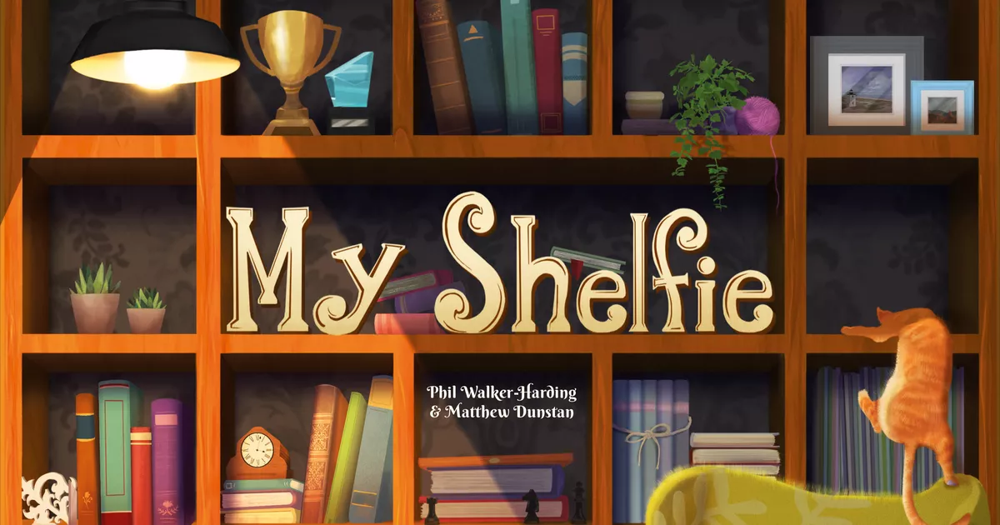

# Prova Finale di Ingegneria del Software - AA 2022-23

Il progetto consiste nell’implementazione di un sistema distribuito composto da un singolo server in grado di gestire una partita alla volta e più client (uno per giocatore). Il server è in grado di supportare una partita alla volta utilizzando il pattern MVC (Model-View-Controller).
La rete è stata gestita tramite l'utilizzo di socket e relativo sistema di messaggistica client-server.

Interazione e gameplay: linea di comando (CLI) e grafica (GUI).

# Documentazione

### UML
Sono riportate di seguito il diagramma UML delle classi implementate ai fini del gioco:
- [UML 1](https://github.com/manuelamarenghi/proj-ingsw-ThomasShelfie/blob/main/uml/uml1.jpeg)
- [UML 2](https://github.com/manuelamarenghi/proj-ingsw-ThomasShelfie/blob/main/uml/uml2.jpeg)
- [UML 3](https://github.com/manuelamarenghi/proj-ingsw-ThomasShelfie/blob/main/uml/uml3.jpeg)

### JavaDoc
Al seguente link è possibile consultare la documentazione Java delle classi implementate: 

### Documentazione Gestione Messaggi Client-Server
Al seguente link è possibile visionare una documentazione dettagliata della gestione dei messaggi Client-Server di cui fa uso l'applicazione: [protocollo](https://github.com/manuelamarenghi/proj-ingsw-ThomasShelfie/blob/main/uml/Descrizione_della_Gestione_dei_Messaggi_nel_Progetto_MyShelfie.docx)

### Strumenti utilizzati
|Libreria/Plugin|Descrizione|
|---------------|-----------|
|__Maven__|Strumento di automazione della compilazione utilizzato principalmente per progetti Java.|
|__JavaFx__|Libreria grafica per realizzare interfacce utente.|
|__JUnit__|Framework di unit testing.|

## Funzionalità
### Funzionalità Sviluppate
- Regole Complete
- CLI
- GUI
- Socket
- 2 FA (Funzionalità Avanzate):
    - __Chat:__ possibilità per ogni giocatore di scambiare messaggi tramite chat privata o di gruppo.
    - __Resistenza alle disconnessioni:__ possibilità per ogni giocatore di disconnettersi e riconnettersi al gioco e relativa gestione da parte del server.
